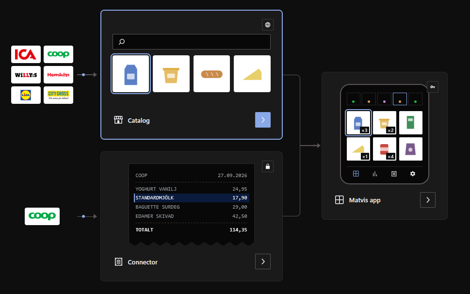
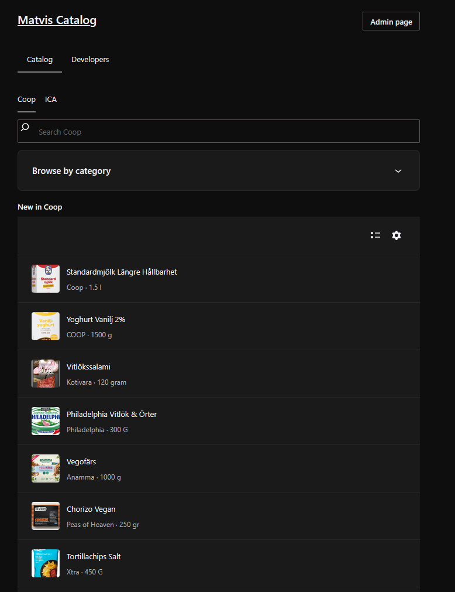
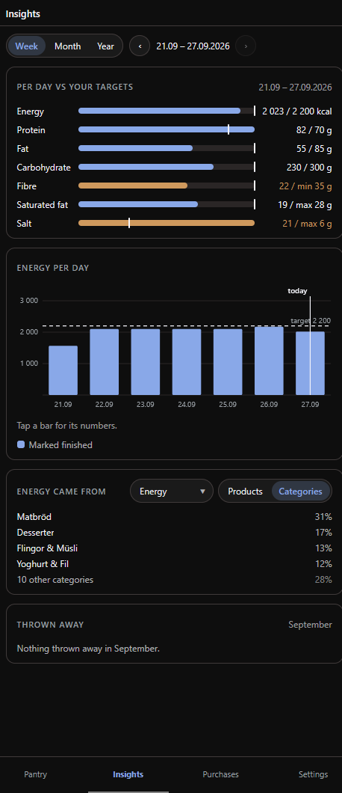
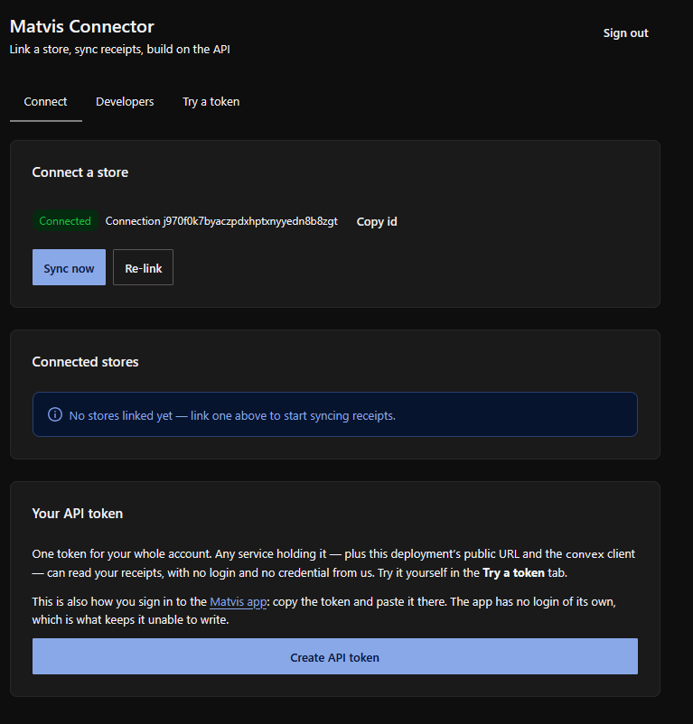

# Matvis



<table>
<tr>
<td width="33%"></td>
<td width="33%"></td>
<td width="33%"></td>
</tr>
</table>

Matvis turns Swedish grocery receipts into a pantry: the **connector** syncs
them from your store account, the **catalog** knows what each product is, and
the **app** turns both into what you have at home.

## Using Matvis

Everything runs at [matvis.qrabbe.de](https://matvis.qrabbe.de).

1. Open the [connector](https://matvis.qrabbe.de/connector/), sign in, and
   link your Coop account with BankID. It syncs your receipts and keeps them up
   to date.
2. Under **Connect**, mint an API token.
3. Open the [app](https://matvis.qrabbe.de/app/) and paste the token.

The [catalog](https://matvis.qrabbe.de/catalog/) is open to everyone, no
account needed.

To build your own program, open the **Developers** tab in the connector or the
catalog. Each one documents its API and the versioned contract it returns,
`Receipt` or `CatalogItem`.

## Developing Matvis

Each of the three is a [Convex](https://convex.dev) backend with a React front
end, written in TypeScript and run with [Bun](https://bun.sh).

|           | Backend               | Front end                   |
| --------- | --------------------- | --------------------------- |
| Connector | `packages/connector`  | `packages/connector-portal` |
| Catalog   | `packages/catalog`    | `packages/catalog-portal`   |
| App       | `packages/app/convex` | `packages/app`              |

Around them, `packages/shared` holds the contracts all three agree on,
`packages/ui` is the design system built on `@wordpress/ui`, and
`packages/landing` is the start page.

```bash
bun install
bunx convex dev                                 # in each package you're touching
bun run --filter @matvis/connector-portal dev   # localhost:5273
```

Before you push, run `bun run format`, `bun run typecheck`, and `bun run
test`. CI runs the same, plus a secret scan.

CI deploys the connector and the catalog on every push to `dev` or `main`. The
app's backend deploys by hand, with `bunx convex deploy`.
